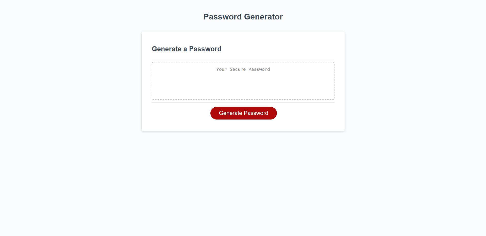

# Password-Generator

[Link to website](https://00anp.github.io/Password-Generator/)

Description

This project contains JavaScript code that can help the user generate a random password letting the user select a number of characters and select criteria to be included in the password.

Password security is an important issue on the internet. The functionality of this tool is totally random. It's recomended to have a lenghty password, and to have different types of criteria in it, based on users selections it will display a password generated at random.

When the user creates a password using this tool, the password is not stored anywhere on the site only on the user's device, as soon as the page is refreshed all of the created passwords will be deleted. (Using the "Console" in the "Inspect" tool in the browser will log all the steps of the algorithm and the passwords created before refreshing the page, this is for educational purposes only).

